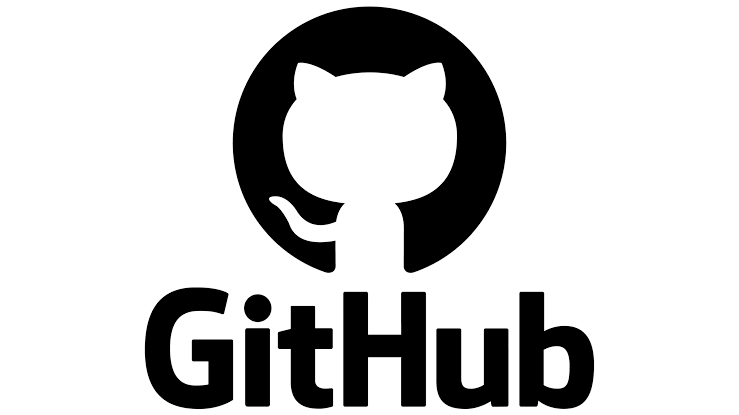

# 李苡翎

## 關於我

大家好，我是李椅零，目前正在學習 GitHub 與 Markdown，希望透過這次練習熟悉 Markdown 文件撰寫與版本控制。

### 我的技能

- **Python 程式設計**
- GitHub 操作
- Markdown 文件撰寫
- 基礎網頁設計

我最擅長的技能是 **Python 程式設計**。

我的座右銘是：

*「一步一步累積，就能看見自己的進步。」*

## 連結

[GitHub](https://github.com/)

## 圖片



### 我喜歡的名言

> 天才是1%的天分加上99%的努力

## 個人資料

| 項目 | 內容 |
|---|---|
| 姓名 | 李椅零 |
| 高中科別 | 商經科 |
| 學習內容 | Python、GitHub、Markdown |

## 程式碼區塊

```python
print("Hello, github!")
```


## 多行引言

> 程式之所以有價值， 是因為它能被閱讀、理解和修改。
>
> 版本控制使這一切成為可能。

## 任務表格

| 任務名稱 | 狀態 | 負責人 | 截止日期 |
|---|:---:|:---:|---:|
| 需求分析 | 完成 | 小明 | 2023-01-15 |
| 資料庫設計 | 進行中 | 小華 | 2023-01-30 |
| 前端介面 | 未開始 | 小李 | 2023-02-15 |
